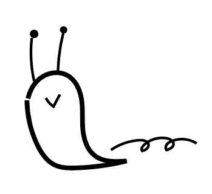
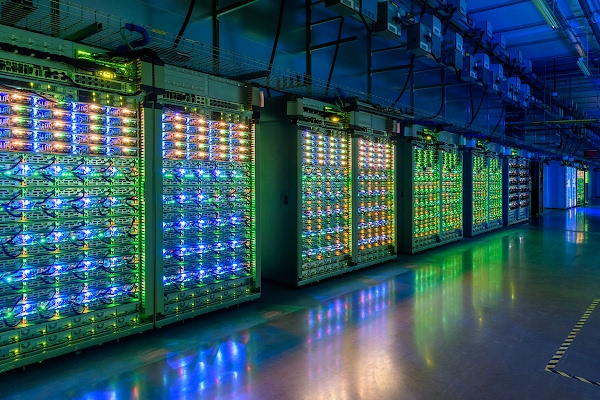

# Homegrown In(ter)dependence

Hello my name is Slug. Not a snail, snails have homes. I need one so I’m building it myself.

## What is a ‘home’ here?

_Home,_

_My house,_

_Where my belongings are…_

My digital photos, videos, works, and memories are all at home.

In your hands, in your machines.

But!

Are you using a cloud service for your data?

Then your data is on companies like Google & Apple’s cloud, which looks like this! It’s called a ‘server farm’.

(Replace with something non-copyright or drawing)

You normally pay monthly to use their homes like this.

## So, what’s the problem?

Tech companies are pushing the idea of ‘unlimited cloud’. So you pay them monthly, and we make more and more files every day.

But actually, the ‘unlimited cloud’ doesn’t exist! They are all physical machines running 24/7, costing a lot of energy and water, and heavily harming our planet. (**ADD SOURCE**) At some point, it will be all out of our hands! How can we call this ‘unlimited’ ?!

Also, what if they suddenly shut your cloud down, or make their prices higher?

1. **We need to rethink our digital habits together.**

2. **We need to be independent of these big tech companies.**

3. **We need to think of our planet we share with other beings; slugs, snails, birds, trees, and many more…!**


🏠 Homegrown In(ter)dependence grows from my own home, your home, and our homes.


## How is this Slug going to guide you?

The example of Slug is to guide you step by step to build your own home.

Your own home is?

A metaphor for **a home server where you store your data**.

For this home,

1. **you don’t need to pay the rent** (_monthly subscriptions_),
2. **you control your own data** (_you have it in your own machine_), and
3. **you control your data even from outside** _(access from outside the home network_).

Like you do with Dropbox, Google Drive, iCloud,… so on.

## It’s going to be a slow & relaxed journey because you know, I’m a Slug.

But it’s exciting, I promise.

Are you ready?

Follow me!

