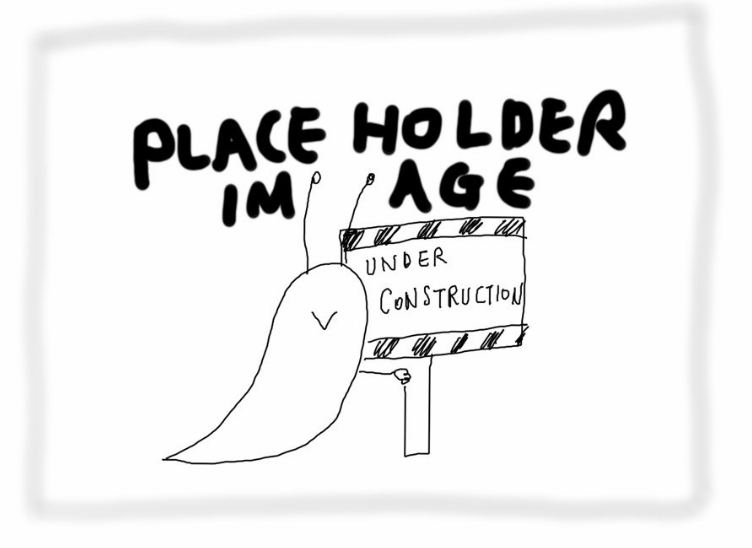
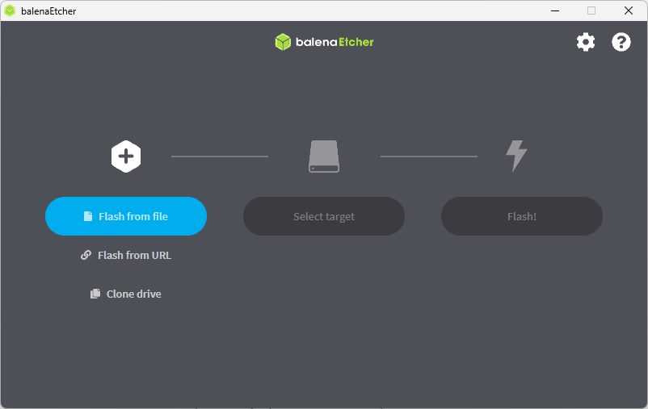
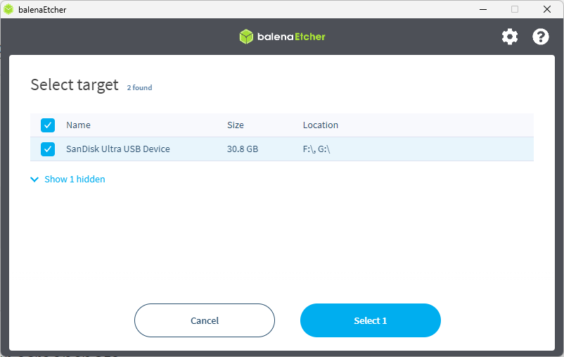
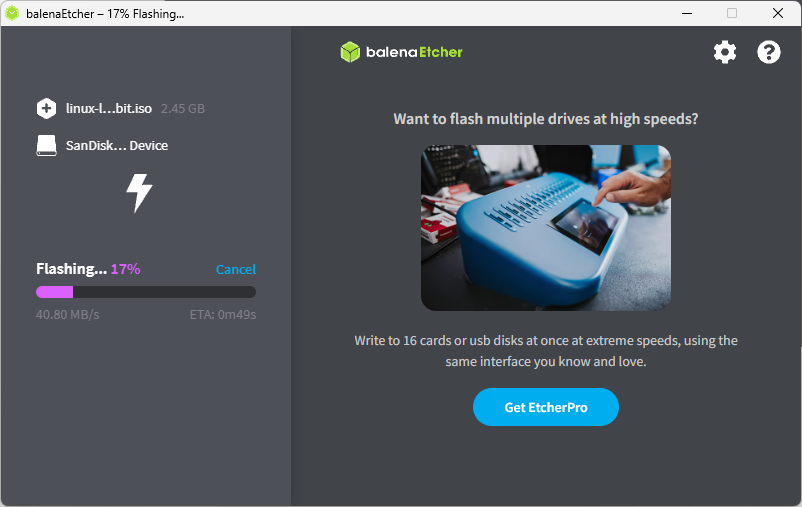

We learned about Linux. Let’s install Linux on your laptop! To do this, we need to make Linux a ‘bootable’ USB stick.



When you turn on your laptop, your laptop finds an **operating system (SECTION LINK)** in your drive and opens that up. That’s how you can see your Windows desktop screen, for example. That’s what you call ‘booting a computer’.

Now your laptop already has Windows installed, it will try to find Windows and boot your laptop with it. We will have to make it open Linux instead, right? But we don’t have Linux installed anywhere yet.

<figure class="">
  
  <figcaption>Image caption</figcaption>
</figure>

In this case, Linux should be made as a ‘bootable’ software. This means that when you turn on your laptop, your laptop automatically reads it as an operating system instead of a program inside your Windows.



## Use Etcher to make a bootable Linux USB Stick

1. **Install** Etcher you just downloaded

   **File name (for example)** balenaEtcher-Setup-1.18.4.exe

2. Open Etcher and Select ‘Flash from file’. Choose the Linux lite .iso file you just downloaded
   <figure class="">
   
   <figcaption>Image caption</figcaption>
   </figure>

3. Inject a USB stick to your laptop and Select it as a target (⚠️SLIPPERY PUDDLE)

   

   Your files on your USB drive will be all deleted! Back them up somewhere else if you need them.

   
   <figure class="">
   
   <figcaption>Image caption</figcaption>
   </figure>

4. **Flash**

    <figure class="">
   
   <figcaption>Image caption</figcaption>
   </figure>
   <figure class="">
   
   <figcaption>Image caption</figcaption>
   </figure>

# Congratulations!

Now you have a USB bootable stick with Linux Lite on it. With this, you can install Linux Lite on your laptop.
