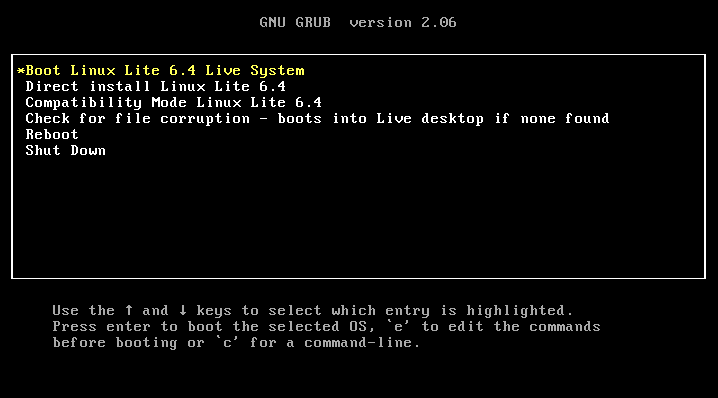



We will delete EVERYTHING from your laptop. If you have anything important, back them up somewhere else!!





**OMG, what is BIOS???**

Before installing Linux Lite, you need to know that we will go into your laptop’s BIOS. This is because we want to boot your computer from the USB stick, instead of your Windows OS.

Don’t worry, we got you.



BIOS stands for ‘Basic Input/Output System’. It’s like the basic of the basic settings you see on your computer. We need to change some of the settings there.





## How to access the BIOS screen

1. **Turn on** the laptop (if it’s already on, **Restart**)
2. **Quickly tab** the hotkey (see below) on your keyboard **_before_** it boots up completely



Every laptop manufacturer has different hotkeys to access the BIOS screen.

- **Acer:** F2 or DEL
- **ASUS:** F2 for all PCs, F2 or DEL for motherboards
- **Dell:** F2 or F12
- **HP:** ESC or F10
- **Lenovo:** F2 or Fn + F2
- **Lenovo (Desktops):** F1
- **Lenovo (ThinkPads):** Enter + F1.
- **MSI:** DEL for motherboards and PCs
- **Origin PC:** F2
- **Samsung:** F2
- **Sony:** F1, F2, or F3
- **Toshiba:** F2
  

If your laptop is not on this list, search on the internet with keywords for example:

"Dell (your laptop’s manufacturer) bios key"

## Install Linux Lite on your secondhand laptop


We made these steps very simple for you. For extensive information, you can also check the [official Linux Lite documentation](https://www.linuxliteos.com/manual/install.html).


1. **Plug** the bootable USB with Linux Lite into your laptop

2. **Turn on** or restart the laptop and quickly **Tap** the hotkey to go into the BIOS mode

3. **Check** the BIOS mode

   It might look like this. ⚠️ But be aware, the settings are different on different machines.
   Don’t be scared! Just check what’s there if you haven’t.

4. **Change** the booting sequence to boot from **a removable device (USB)**

   Normally your laptop will try to start the operating system from a hard drive as default. But we need it to start from our USB stick with Linux Lite that we made in the last chapter so that we can see the Linux Lite installation screen when booting up.
   Although the settings are written differently, you can check **‘Booting sequence’**, **‘Boot’**, **‘Boot options’**, and **‘Boot order’**… and make sure the ‘Removable Devices’ or ‘USB’ is on top of the booting order.
   This means, when you turn on your laptop, it will start booting up from the ‘Removable Devices’ or ‘USB’ first.

5. **Enable** UEFI mode UEFI mode does the same job as BIOS. But it is designed to overcome many limitations of the old BIOS mode.

   To boot from our USB with Linux Lite, we need to enable UEFI mode.  

6. **Save** settings & **Restart**

   

   #### Troubleshooting

   **If you get an error ‘no boot device found’**

   1. **Press** any key to reboot the machine
   2. **Go** to BIOS again by **Tapping** the BIOS Hotkey
   3. **Go** to the boot options and see if there’s a **‘Secure Boot’** mode
   4. **Disable** ‘Secure Boot’ mode
   5. **Save** settings & **Restart**
      



(The second option from this image)
Your laptop will reboot.


8. **Select** your language, and keyboard, and **Continue**

9. **Select** _‘I don’t want to connect to a Wi-Fi network right now’_ and **Continue**
10. **Deselect** ‘Download updates while installing Linux’ and **Select** ‘install third-party software during the installation’
11. **Select** _'Erase disk and install Linux’_ and **Install Now**

12. **Select** where you are

13. **Type** in the Who are you? Screen

    - **Your name:** Your full name.
    - **Your computer's name:** The name that will be displayed in your network.
    - **Pick a username:** Your username that will be used to log into your computer.
    - **Choose a password:** Your password that you wish to use for your user and administrator password. (Don’t forget this password! And choose the strong (complicated) one. You can also change it later.)
    - **Confirm your password:** enter the above password again.

After this, your laptop will reboot and process the installation.

## OMG! Congratulations!

Now you have Linux on your laptop!!!!

It wasn’t bad, right?
